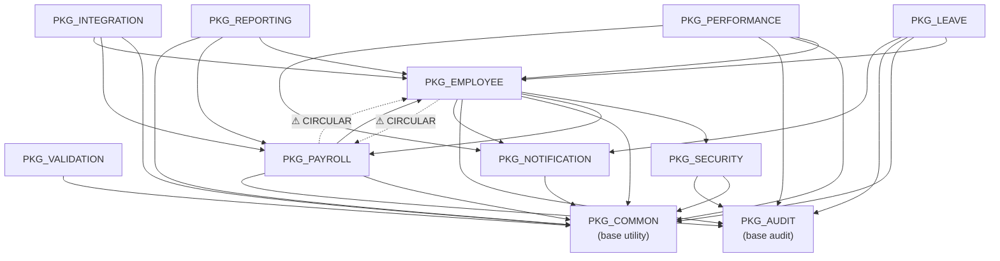

# Dependency Map — Oracle Forms/PL/SQL HRMS Estate

## 1. Architecture Overview

```
┌─────────────────────────────────────────────────────────┐
│                    CLIENT TIER                          │
│  Oracle Forms 12c  ──▶  HRMS_MENU (MDI Parent)         │
│    ├── HRMS_LOGIN                                       │
│    ├── HRMS_EMPLOYEE                                    │
│    ├── HRMS_LEAVE                                       │
│    ├── HRMS_PAYROLL                                     │
│    └── HRMS_PERFORMANCE                                 │
│  Attached Libraries: HRMS_COMMON_LIB, HRMS_VALIDATION  │
├─────────────────────────────────────────────────────────┤
│                  MIDDLEWARE TIER                         │
│  Oracle WebLogic Server 12c                             │
│    ├── Forms Runtime                                    │
│    └── Reports Server                                   │
├─────────────────────────────────────────────────────────┤
│                   DATABASE TIER                          │
│  Oracle Database 19c — Schema: HRMS                     │
│    ├── PL/SQL Packages (11)                             │
│    ├── Database Triggers (6)                            │
│    ├── Tables (30)  │  Views (6)  │  Sequences (29)    │
│    └── DBMS_SCHEDULER Jobs                              │
└─────────────────────────────────────────────────────────┘
```

---

## 2. Forms → PLL Library Dependencies

All forms attach both shared libraries for UI utilities and client-side validation.

```
HRMS_LOGIN ──────────┐
HRMS_EMPLOYEE ───────┤
HRMS_LEAVE ──────────┼──▶ HRMS_COMMON_LIB.pll.sql
HRMS_PAYROLL ────────┤      (message display, navigation, LOV helpers)
HRMS_PERFORMANCE ────┤
HRMS_MENU ───────────┘

HRMS_LOGIN ──────────┐
HRMS_EMPLOYEE ───────┤
HRMS_LEAVE ──────────┼──▶ HRMS_VALIDATION_LIB.pll.sql
HRMS_PAYROLL ────────┤      (email, phone, SSN, salary, date validation)
HRMS_PERFORMANCE ────┤
HRMS_MENU ───────────┘
```

---

## 3. Forms → PL/SQL Package Dependencies

```
HRMS_LOGIN
  ├──▶ PKG_SECURITY.authenticate()
  ├──▶ PKG_SECURITY.validate_session()
  └──▶ PKG_SECURITY.has_role()

HRMS_EMPLOYEE
  ├──▶ PKG_EMPLOYEE.create_employee()
  ├──▶ PKG_EMPLOYEE.update_employee()
  ├──▶ PKG_EMPLOYEE.get_employee()
  ├──▶ PKG_EMPLOYEE.terminate_employee()
  ├──▶ PKG_SECURITY.validate_session()
  └──▶ PKG_COMMON.format_phone(), format_ssn_masked()

HRMS_LEAVE
  ├──▶ PKG_LEAVE.submit_leave_request()
  ├──▶ PKG_LEAVE.approve_leave_request()
  ├──▶ PKG_LEAVE.reject_leave_request()
  ├──▶ PKG_LEAVE.cancel_leave_request()
  ├──▶ PKG_LEAVE.get_leave_balance()
  └──▶ PKG_SECURITY.validate_session()

HRMS_PAYROLL
  ├──▶ PKG_PAYROLL.create_pay_periods()
  ├──▶ PKG_PAYROLL.create_payroll_run()
  ├──▶ PKG_PAYROLL.calculate_payroll()
  ├──▶ PKG_PAYROLL.approve_payroll()
  └──▶ PKG_SECURITY.validate_session()

HRMS_PERFORMANCE
  ├──▶ PKG_PERFORMANCE.create_review_cycle()
  ├──▶ PKG_PERFORMANCE.create_review()
  ├──▶ PKG_PERFORMANCE.submit_self_assessment()
  ├──▶ PKG_PERFORMANCE.submit_manager_review()
  ├──▶ PKG_PERFORMANCE.add_goal()
  └──▶ PKG_SECURITY.validate_session()

HRMS_MENU
  ├──▶ PKG_SECURITY.has_role()  (menu item visibility)
  └──▶ OPEN_FORM()  (launches all child forms)
```

---

## 4. PL/SQL Package → Package Dependencies

### Dependency Graph



### Dependency Matrix

| Package ↓ depends on → | COMMON | AUDIT | VALIDATION | NOTIFICATION | SECURITY | EMPLOYEE | PAYROLL | LEAVE | PERFORMANCE | REPORTING | INTEGRATION |
|------------------------|:------:|:-----:|:----------:|:------------:|:--------:|:--------:|:-------:|:-----:|:-----------:|:---------:|:-----------:|
| **PKG_COMMON** | — | | | | | | | | | | |
| **PKG_AUDIT** | | — | | | | | | | | | |
| **PKG_VALIDATION** | ✓ | | — | | | | | | | | |
| **PKG_NOTIFICATION** | ✓ | | | — | | | | | | | |
| **PKG_SECURITY** | ✓ | ✓ | | | — | | | | | | |
| **PKG_EMPLOYEE** | ✓ | ✓ | | ✓ | ✓ | — | ⚠ | | | | |
| **PKG_PAYROLL** | ✓ | ✓ | | | | ⚠ | — | | | | |
| **PKG_LEAVE** | ✓ | ✓ | | ✓ | | ✓ | | — | | | |
| **PKG_PERFORMANCE** | ✓ | ✓ | | ✓ | | ✓ | | | — | | |
| **PKG_REPORTING** | ✓ | | | | | ✓ | ✓ | | | — | |
| **PKG_INTEGRATION** | ✓ | | | | | ✓ | ✓ | | | | — |

**Legend**: ✓ = direct dependency, ⚠ = circular dependency

---

## 5. Circular Dependencies

### PKG_EMPLOYEE ↔ PKG_PAYROLL

This is the only circular dependency in the system.

```
PKG_EMPLOYEE                         PKG_PAYROLL
  │                                    │
  ├── Calls PKG_PAYROLL for:           ├── Calls PKG_EMPLOYEE for:
  │   salary validation during          │   is_active_employee() check
  │   hire/transfer/promote             │   during payroll calculation
  │                                    │
  └────────── CIRCULAR ◄──────────────┘
```

**Impact**:
- Compilation order matters: must compile specs first (both), then bodies
- If either package body is invalidated, the other may cascade-invalidate
- Runtime risk: mutation during payroll if employee status changes mid-run

**Documented in**:
- `PKG_EMPLOYEE.pkb` line 9: `"Circular dependency with PKG_PAYROLL (salary validation)"`
- `PKG_PAYROLL.pks` line 9: `"Circular dependency with PKG_EMPLOYEE (is_active check)"`

---

## 6. PL/SQL Package → Database Table Dependencies

### Read (SELECT) Dependencies

| Package | Tables Read |
|---------|------------|
| PKG_COMMON | AUDIT_LOG, SYSTEM_PARAMETERS |
| PKG_AUDIT | AUDIT_LOG |
| PKG_VALIDATION | EMPLOYEES, JOB_GRADES, HOLIDAYS |
| PKG_NOTIFICATION | EMPLOYEES, NOTIFICATION_QUEUE |
| PKG_SECURITY | EMPLOYEES, USER_SESSIONS, SYSTEM_PARAMETERS |
| PKG_EMPLOYEE | EMPLOYEES, EMPLOYEE_HISTORY, EMPLOYEE_DEPENDENTS, EMERGENCY_CONTACTS, SALARY_RECORDS, DEPARTMENTS, JOB_TITLES, JOB_GRADES |
| PKG_PAYROLL | PAY_PERIODS, PAYROLL_RUNS, PAYROLL_DETAILS, PAY_ELEMENTS, EMPLOYEE_PAY_ELEMENTS, SALARY_RECORDS, TAX_BRACKETS, EMPLOYEE_TAX_INFO, EMPLOYEES |
| PKG_LEAVE | LEAVE_REQUESTS, LEAVE_BALANCES, LEAVE_TYPES, LEAVE_ACCRUAL_LOG, HOLIDAYS, EMPLOYEES |
| PKG_PERFORMANCE | REVIEW_CYCLES, PERFORMANCE_REVIEWS, PERFORMANCE_GOALS, EMPLOYEES, JOB_TITLES, DEPARTMENTS |
| PKG_REPORTING | EMPLOYEES, DEPARTMENTS, LOCATIONS, JOB_TITLES, JOB_GRADES, SALARY_RECORDS, LEAVE_BALANCES, LEAVE_TYPES, PAYROLL_DETAILS, PAYROLL_RUNS, PAY_PERIODS, PAY_ELEMENTS |
| PKG_INTEGRATION | PAYROLL_DETAILS, PAYROLL_RUNS, PAY_PERIODS, EMPLOYEES, DEPARTMENTS, PAY_ELEMENTS, EMPLOYEE_DEPENDENTS |

### Write (INSERT/UPDATE/DELETE) Dependencies

| Package | Tables Modified |
|---------|----------------|
| PKG_COMMON | AUDIT_LOG (INSERT), SYSTEM_PARAMETERS (UPDATE) |
| PKG_AUDIT | AUDIT_LOG (INSERT, DELETE for purge) |
| PKG_NOTIFICATION | NOTIFICATION_QUEUE (INSERT, UPDATE) |
| PKG_SECURITY | USER_SESSIONS (INSERT, UPDATE) |
| PKG_EMPLOYEE | EMPLOYEES (INSERT, UPDATE), EMPLOYEE_HISTORY (INSERT), SALARY_RECORDS (INSERT, UPDATE) |
| PKG_PAYROLL | PAY_PERIODS (INSERT, UPDATE), PAYROLL_RUNS (INSERT, UPDATE), PAYROLL_DETAILS (INSERT, UPDATE) |
| PKG_LEAVE | LEAVE_REQUESTS (INSERT, UPDATE), LEAVE_BALANCES (INSERT, UPDATE), LEAVE_ACCRUAL_LOG (INSERT) |
| PKG_PERFORMANCE | REVIEW_CYCLES (INSERT, UPDATE), PERFORMANCE_REVIEWS (INSERT, UPDATE), PERFORMANCE_GOALS (INSERT, UPDATE) |
| PKG_INTEGRATION | File I/O only (UTL_FILE) — no direct table writes |
| PKG_REPORTING | Reads only (all reports return REF CURSORs) |

---

## 7. Database Trigger Dependencies

```
SALARY_RECORDS
  └── AFTER INSERT/UPDATE/DELETE ──▶ TRG_SALARY_AUDIT
        └──▶ PKG_AUDIT.log_action() ──▶ AUDIT_LOG (INSERT)

LEAVE_REQUESTS
  └── AFTER UPDATE OF STATUS ──▶ TRG_LEAVE_REQUEST_AUDIT
        └──▶ PKG_AUDIT.log_action() ──▶ AUDIT_LOG (INSERT)

DEPARTMENTS
  └── AFTER INSERT/UPDATE/DELETE ──▶ TRG_DEPARTMENT_AUDIT
        └──▶ PKG_AUDIT.log_action() ──▶ AUDIT_LOG (INSERT)

EMPLOYEES
  ├── BEFORE INSERT ──▶ TRG_EMP_BEFORE_INSERT
  │     ├── Sets audit defaults (CREATED_BY, CREATED_DATE)
  │     ├── Sets ACTIVE_FLAG = 'Y', EMPLOYMENT_STATUS = 'ACTIVE'
  │     ├── Validates hire date (≤180 days future)
  │     └── Checks email uniqueness (SELECT on EMPLOYEES)
  │
  ├── BEFORE UPDATE ──▶ TRG_EMP_BEFORE_UPDATE
  │     ├── Sets MODIFIED_BY, MODIFIED_DATE
  │     ├── Prevents TERMINATED → ACTIVE reactivation
  │     └── Logs to EMPLOYEE_HISTORY (INSERT):
  │           status changes, department transfers, job changes
  │
  └── BEFORE DELETE ──▶ TRG_EMP_INSTEAD_OF_DELETE
        └── RAISES ERROR -20504 (enforces soft-delete)
```

---

## 8. Shared Utilities Analysis

### Most-Depended-On Packages

```
                         Dependents
PKG_COMMON          ──▶  9  (all other packages)
PKG_AUDIT           ──▶  6  (SECURITY, EMPLOYEE, PAYROLL, LEAVE, PERFORMANCE + triggers)
PKG_NOTIFICATION    ──▶  4  (EMPLOYEE, LEAVE, PERFORMANCE + scheduler)
PKG_EMPLOYEE        ──▶  5  (PAYROLL, LEAVE, PERFORMANCE, REPORTING, INTEGRATION)
PKG_PAYROLL         ──▶  3  (EMPLOYEE [circular], REPORTING, INTEGRATION)
PKG_SECURITY        ──▶  1  (EMPLOYEE) + all Forms (session validation)
```

### Coupling Hotspots

| Component | Fan-In (depended on by) | Fan-Out (depends on) | Coupling Risk |
|-----------|:-----------------------:|:--------------------:|:-------------:|
| PKG_COMMON | 9 | 0 | Low (stable base) |
| PKG_AUDIT | 6 | 0 | Low (stable base) |
| PKG_EMPLOYEE | 5 | 5 | **HIGH** (high fan-in + fan-out) |
| PKG_PAYROLL | 3 | 3 | **MEDIUM** (circular dep) |
| PKG_NOTIFICATION | 4 | 1 | Low |
| PKG_SECURITY | 1 + all forms | 2 | Medium |

---

## 9. Batch Job Scheduling Topology (DBMS_SCHEDULER)

The following batch jobs are referenced in code comments and package bodies:

```
┌──────────────────────────────────────────────────────────────────────┐
│                    DBMS_SCHEDULER JOB TOPOLOGY                       │
├──────────────────────────────────────────────────────────────────────┤
│                                                                      │
│  EVERY 5 MINUTES                                                     │
│  ├── Notification Queue Processor                                    │
│  │   └── PKG_NOTIFICATION.process_queue(p_batch_size => 50)         │
│  │       Sends pending emails via UTL_SMTP                          │
│  │                                                                   │
│  NIGHTLY                                                             │
│  ├── Reporting Table Refresh                                         │
│  │   └── PKG_REPORTING.refresh_reporting_tables()                   │
│  │       Refreshes denormalized reporting tables                    │
│  │                                                                   │
│  ├── GL Feed Generation                                              │
│  │   └── PKG_INTEGRATION.generate_gl_journal(p_run_id)             │
│  │       Writes pipe-delimited flat file to GL_FEED_OUT directory   │
│  │                                                                   │
│  ├── Leave Accrual Processing                                        │
│  │   └── PKG_LEAVE.run_accrual()                                    │
│  │       Monthly/biweekly accrual based on leave type frequency     │
│  │                                                                   │
│  ├── Leave Carryover Expiry                                          │
│  │   └── PKG_LEAVE (carryover expiry logic)                         │
│  │       Expires unused carryover past expiry date                  │
│  │       BUG: Can double-expire if run twice on same day            │
│  │                                                                   │
│  WEEKLY                                                              │
│  ├── Benefits Feed Export                                            │
│  │   └── PKG_INTEGRATION.export_benefits_feed()                    │
│  │       ADP-format fixed-width file to BENEFITS_FEED_OUT           │
│  │                                                                   │
│  ├── Audit Log Purge (configurable retention)                        │
│  │   └── PKG_AUDIT.purge_old_records(p_days_to_keep => 365)        │
│  │                                                                   │
│  ANNUAL/ON-DEMAND                                                    │
│  ├── Leave Balance Initialization                                    │
│  │   └── PKG_LEAVE.initialize_annual_balances()                     │
│  │       Year-start balance setup with carryover                    │
│  │                                                                   │
│  └── Performance Review Generation                                   │
│      └── PKG_PERFORMANCE.generate_reviews_for_cycle(p_cycle_id)     │
│          Bulk-creates reviews for all active employees               │
│                                                                      │
│  FILE EXCHANGE DIRECTORIES (Oracle Directory Objects):               │
│  ├── GL_FEED_OUT       → GL journal flat files                      │
│  ├── BENEFITS_FEED_OUT → ADP benefits enrollment files              │
│  └── TIME_ATTENDANCE_IN → Time/attendance CSV imports               │
│                                                                      │
└──────────────────────────────────────────────────────────────────────┘
```

### Job Dependencies

```
Leave Accrual Job ──▶ updates LEAVE_BALANCES
                  ──▶ inserts LEAVE_ACCRUAL_LOG

Payroll Run (manual) ──▶ reads SALARY_RECORDS, EMPLOYEE_PAY_ELEMENTS
                     ──▶ reads TAX_BRACKETS, EMPLOYEE_TAX_INFO
                     ──▶ writes PAYROLL_DETAILS
                     ──▶ triggers TRG_SALARY_AUDIT on salary changes

GL Feed Job ──▶ reads PAYROLL_DETAILS, PAYROLL_RUNS, PAY_PERIODS
            ──▶ reads PAY_ELEMENTS, EMPLOYEES, DEPARTMENTS
            ──▶ writes flat file (UTL_FILE)

Benefits Feed Job ──▶ reads EMPLOYEES, EMPLOYEE_DEPENDENTS
                  ──▶ writes flat file (UTL_FILE)
```

---

## 10. Full Multi-Layer Dependency Flow

```
 FORMS LAYER           LIBRARY LAYER       PACKAGE LAYER                TABLE LAYER
 ============          =============       =============                ===========

 HRMS_MENU ──────────▶ COMMON_LIB ───┐
   │ (launches)        VALIDATION_LIB ─┤
   ▼                                   │
 HRMS_LOGIN ─────────▶ ───────────────▶ PKG_SECURITY ──────────────▶ EMPLOYEES
                                        │                            USER_SESSIONS
                                        ▼
 HRMS_EMPLOYEE ──────▶ ───────────────▶ PKG_EMPLOYEE ──────────────▶ EMPLOYEES
                                        │  ⚠ circular               EMPLOYEE_HISTORY
                                        ▼                            SALARY_RECORDS
                                       PKG_PAYROLL ────────────────▶ PAY_PERIODS
                                        │                            PAYROLL_RUNS
                                        │                            PAYROLL_DETAILS
                                        ▼
 HRMS_LEAVE ─────────▶ ───────────────▶ PKG_LEAVE ─────────────────▶ LEAVE_REQUESTS
                                        │                            LEAVE_BALANCES
                                        ▼                            HOLIDAYS
                                       PKG_NOTIFICATION ───────────▶ NOTIFICATION_QUEUE

 HRMS_PAYROLL ───────▶ ───────────────▶ PKG_PAYROLL ───────────────▶ (see above)
                                        │
                                        ▼
                                       PKG_INTEGRATION ────────────▶ UTL_FILE (flat files)

 HRMS_PERFORMANCE ───▶ ───────────────▶ PKG_PERFORMANCE ───────────▶ REVIEW_CYCLES
                                        │                            PERFORMANCE_REVIEWS
                                        ▼                            PERFORMANCE_GOALS
                                       PKG_NOTIFICATION

 (Oracle Reports) ───▶ ───────────────▶ PKG_REPORTING ─────────────▶ (read-only, many tables)

 CROSS-CUTTING:
   PKG_COMMON   ────▶ AUDIT_LOG, SYSTEM_PARAMETERS  (used by ALL packages)
   PKG_AUDIT    ────▶ AUDIT_LOG                      (used by 6+ packages + triggers)
   PKG_VALIDATION ──▶ EMPLOYEES, JOB_GRADES, HOLIDAYS (used by forms + packages)
```
